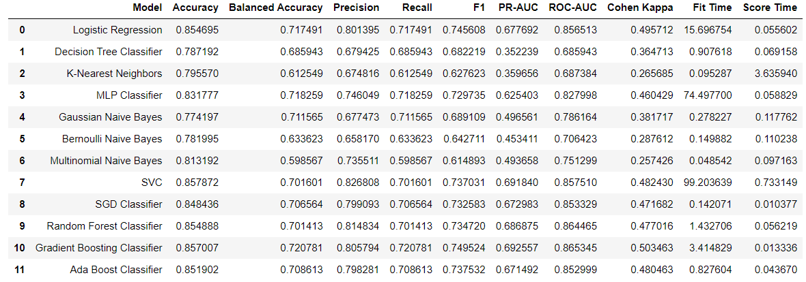

  <h3 align="center">Rain Prediction</h3>

  

    This project involves exploratory data analysis, data pre-processing, training multiple baseline machine learning models, hyperparameter tuning and building ensemble models to predict next-day rain in Australia.
  

<h3 id="about-the-project">About The Project</h3>

<b>Data source:</b>
 
https://www.kaggle.com/jsphyg/weather-dataset-rattle-package

<b>This project was built with:</b>
 
* [Scikit-learn](https://scikit-learn.org/)
* [Matplotlib](https://matplotlib.org/)
* [Seaborn](https://seaborn.pydata.org/)
* [Pickle](https://docs.python.org/3/library/pickle.html)

<h3 id="summary">Project Summary</h3>

  <ol>
    <li>
      <b>Data Understanding</b>  
      <ul><li>Descriptions of variables</li></ul>
    </li>
    <li>
      <b>Exploratory Data Analysis</b> 
      <ul><li>Exploring the categorical and numerial variables</li>
      <li>Feature engineering of Date variable</li>
      <li>Outlier detection using boxplots</li>
      <li>Checking the distribution of numerical variables using histograms</li>
      <li>Checking the distribution of target variable (class distribution)</li>
      <li>Correlation analysis</li>
      <li>Checking for duplicates</li></ul>
    </li>
    <li>
      <b>Data Pre-processing</b> 
      <ul><li>Handling missing values<li>
      <li>Removing outliers<li>
      <li>Categorical data encoding<li>
      <li>Feature scaling</li></ul>
    </li>
    <li>
      <b>Training Baseline Models</b> 
      <ul><li>Created a function to evaluate performance of multiple models using multiple metrics through Cross Validation</li></ul>
       
      

       
    </li>
    <li>
      <b>Feature Selection</b> 
      <ul><li>Principal Component Analysis (PCA)</li></ul>
    </li>
    <li>
      <b>Shortlisting the Best Models</b> 
      <ul><li>Selected the top 3 models</li></ul>
    </li>
    <li>
      <b>Hyperparameter Tuning</b> 
      <ul><li>Determined the best parameters of the models using Randomized Search Cross Validation</li></ul>
    </li>
    <li>
      <b>Building Ensemble Models</b> 
      <ul><li>Built 3 ensemble models using Stacking Classifier</li></ul>
    </li>
    <li>
      <b>Model Evaluation</b> 
      <ul><li>Evaluated the performance of the 3 inital shortlisted models and the 3 ensemble models<li>
      <li>Plotted learning curves to compare the performance of the models on training and testing data<li>
      <li>Determined the best model</li></ul>
    </li>
  </ol>

